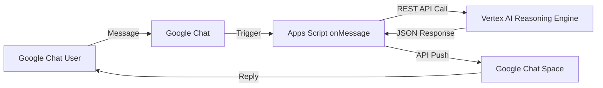

# Objective

Connect Google Chat to the actual Loan Supervisor Agent hosted on Vertex AI Reasoning Engine, moving away from hardcoded responses, to provide dynamic, agentic responses for the demo.

# Tech Details:

* Project: demo4events10
* Platform: Google Apps Script
* Bot Type: Workspace Add-on (Interactive)
* Agent Resource: `projects/53454032082/locations/us-central1/reasoningEngines/5328541761214087168`

# Architecture

The architecture uses a serverless Google Apps Script bridge to call the Vertex AI Reasoning Engine API.

## Components

1.  **Google Chat App**: Configured to use a Google Apps Script deployment as the backend.
2.  **Google Apps Script**:
    *   Acts as the webhook handler (`onMessage`).
    *   Uses `UrlFetchApp` to make an authenticated REST call to the Reasoning Engine endpoint.
    *   Bypasses synchronous return payload issues by using the Google Chat API to **push** messages directly back to the space.

# Confirmed Details

*   **API Protocol**: Uses `POST` to the `:query` endpoint.
*   **Payload Structure**: Uses standard `{"input": {"input": "user's message"}}` without requiring a custom `classMethod`.
*   **Authentication**: Uses `ScriptApp.getOAuthToken()` with the `cloud-platform` scope.
