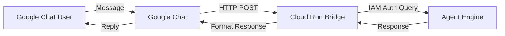

# Objective

Call ADK Agent that is hosted in Agent Agent from Google Chat

# Non-functional requirements

* As simple as possible - this is for demo purposes only, not production grade system.
* Quick and simple to implement and deploy, I need to wrap all thingsi n less than 1 hour.
* Needs to be robust: cannot fail given it will be used in a high-stakes presentation.

# Tech Details:

* Project: demo4events10
* Agent: projects/53454032082/locations/us-central1/reasoningEngines/5328541761214087168
  * Query URL: https://us-central1-aiplatform.googleapis.com/v1/projects/demo4events10/locations/us-central1/reasoningEngines/5328541761214087168:query
  * Stream Query URL: https://us-central1-aiplatform.googleapis.com/v1/projects/demo4events10/locations/us-central1/reasoningEngines/5328541761214087168:streamQuery?alt=sse

# Proposed Architecture

To connect Google Chat to the Agent Engine (Vertex AI Reasoning Engine) simply and robustly, we propose a bridge service hosted on Cloud Run.

## Components

1.  **Google Chat App**: Configured with an HTTP endpoint pointing to the Cloud Run service.
2.  **Cloud Run Service**: A Python-based web server (e.g., FastAPI or Flask) that:
    *   Receives events from Google Chat.
    *   Extracts the user message.
    *   Calls the Vertex AI Reasoning Engine API using the `google-cloud-aiplatform` SDK or direct HTTP request with IAM credentials.
    *   Returns a JSON response formatted for Google Chat.

## Confirmed Architecture Details

*   **No Streaming**: Standard `query` will be used.
*   **Interaction Style**: The bot will respond to **Mentions in Spaces** (e.g., `@Bot message`). We will parse the message to handle the mention.
*   **Authentication**: We will use a simple check for a shared secret in a query parameter (e.g., `?secret=...`) for minimal security, avoiding full JWT verification to save time.
*   **Stateless & Single-Turn**: The interaction is single-turn. The agent will return prescripted responses to predefined questions.
*   **Deployment**: The bridge service will be deployed to **Cloud Run** in the `demo4events10` project.

# Implementation Plan

1.  **Create Cloud Run Service**:
    *   Create a Python application (FastAPI) in `chat_integration/app/`.
    *   Implement endpoint to receive Chat events, parse messages, call Vertex AI Reasoning Engine, and return Chat-formatted responses.
2.  **Deploy**:
    *   Deploy to Cloud Run using `gcloud`.
3.  **Configuration**:
    *   Set up the Google Chat App in the Workspace Developer Console with the Cloud Run URL.

# Results

*   **Cloud Run Service URL**: `https://chat-bridge-53454032082.us-central1.run.app` (Private)
*   **Pub/Sub Topic**: `projects/demo4events10/topics/chat-events`
*   **Pub/Sub Subscription**: `projects/demo4events10/subscriptions/chat-sub`
*   **Status**: Resources created and permissions granted at the project level.

# Final Step

**Configure Google Chat**: In the Google Workspace Developer Console, set the interaction endpoint to **Pub/Sub** and specify the topic: `projects/demo4events10/topics/chat-events`.

