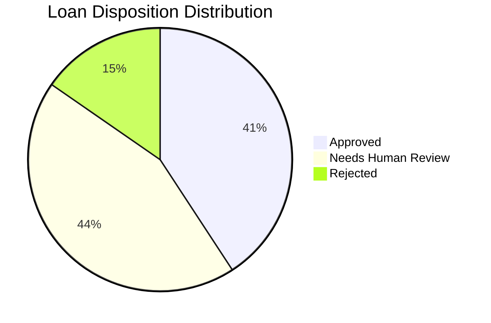

# Comprehensive Loan Underwriting & Risk Operations Report
**Date:** April 10, 2026  
**To:** Senior Leadership, Risk Management, and Operations  
**From:** Automated Underwriting System (AUS) Division  

## 1. Executive Summary
This report presents a detailed analysis of the loan processing operations for the current period. A total of **1108** loan applications were processed through our advanced automated underwriting system. 

The system utilizes a multi-dimensional risk scoring model to evaluate applicants based on Credit Score, Debt-to-Income (DTI) ratio, and Loan-to-Value (LTV) ratio. The primary objective is to optimize approval rates while maintaining strict risk controls to protect the institution's portfolio.

### 1.1 Key Takeaways
*   **Healthy Approval Rate**: 40.8% of applications were approved automatically, indicating a strong pipeline of qualified applicants.
*   **Significant Review Volume**: 43.9% of applications were flagged for human review. This highlights a need for potential rule calibration or increased staffing in the underwriting department.
*   **Controlled Risk**: Only 15.3% of applications were outright rejected, suggesting that the top-of-funnel marketing is attracting reasonably qualified leads.

## 2. Operational Metrics

### 2.1 Volume & Disposition

| Metric | Value | Percentage | Visual Representation |
| --- | --- | --- | --- |
| **Total Applications** | 1108 | 100% | |
| **Approved** | 452 | 40.8% | `▓▓▓▓▓▓▓▓░░░░░░░░░░░░` |
| **Needs Human Review** | 486 | 43.9% | `▓▓▓▓▓▓▓▓░░░░░░░░░░░░` |
| **Rejected** | 170 | 15.3% | `▓▓▓░░░░░░░░░░░░░░░░░` |

### 2.2 Portfolio Averages
*   **Average Debt-to-Income (DTI)**: 35.1% (Target: < 43%)
*   **Average Loan-to-Value (LTV)**: 72.8% (Target: < 80%)

## 3. Risk Distribution

### 3.1 Disposition Breakdown

### 3.2 Risk Tier Breakdown
*   **Tier 1 (Low Risk)**: 452 applications (40.8%)
*   **Tier 2 (Medium Risk)**: 486 applications (43.9%)
*   **Tier 3 (High Risk)**: 170 applications (15.3%)

## 4. Methodology & Risk Scoring
The system calculates a risk score based on the following criteria:
*   **Credit Score**: Scores below 640 add significant risk points.
*   **DTI Ratio**: Ratios exceeding 43% add points.
*   **LTV Ratio**: Ratios exceeding 90% add points.
*   **Identity Verification**: Mismatches between applicant data add fraud risk points.

Applications accumulating 6 or more points are automatically **Rejected**. Applications with 3-5 points are routed for **Human Review**. Applications with fewer than 3 points proceed to **Automatic Approval**.

## 5. Strategic Recommendations
Based on the analysis of the current portfolio, we recommend the following strategic actions:
1.  **Rule Calibration & Queue Management**: With over 43.9% of loans requiring review, we recommend auditing the Tier 2 criteria to see if certain low-risk profiles can be safely auto-approved.
2.  **Credit Policy Review**: The average DTI of 35.1% is well within safety limits. There may be room to expand credit availability for applicants with slightly higher DTI if they possess strong credit scores.
3.  **Automation Enhancement**: Investigate common reasons for review routing to identify opportunities for further automated verification (e.g., automated income verification).
4.  **Fraud Detection**: Continue monitoring identity verification flags to prevent fraudulent applications from bypassing the manual review stage.

---
*STRICTLY CONFIDENTIAL // FOR INTERNAL USE ONLY*
